# Bleed for Py 

In this repo andre air tries to learn pthon in 30 days startin at:
p
> 2/12/23 03:30:11

Otherwise he will not destoy his phone and stay in Ukraine till summer.

## Todo

- [ ] Dualingo
- [ ] Do Touch Typing
- [ ] English Lesson 7 Max notes
- [ ] Watch this [NeetCode Python for Cdoing Interview](./res/videos/NeetCode-PythonForInterview.mp4)
- [ ] Type questions
- [ ] Type notes
- [ ] Redo what he does on video without looking
- [ ] LeetCode

## Deepwork

 
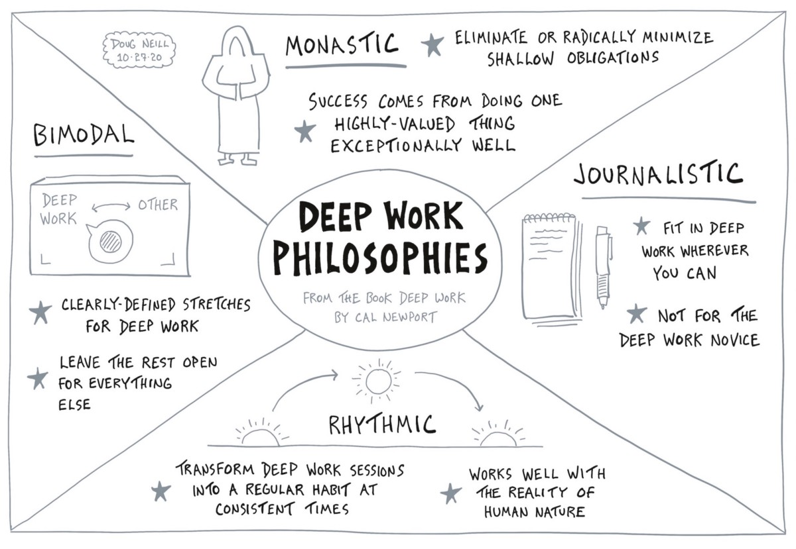

## Books

- [Crash Course](./pdf/APythonCrashCourse.pdf)

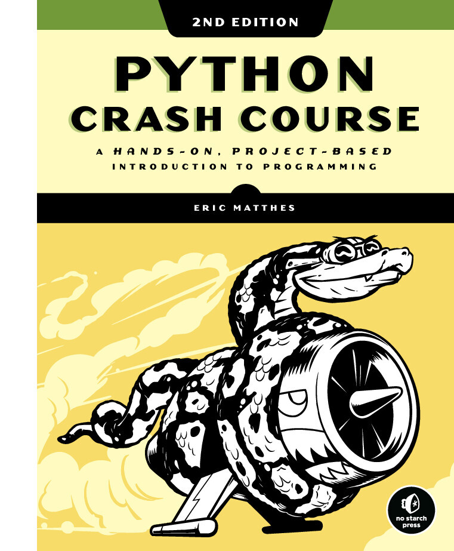

- [Python in One Day](./pdf/PythonInOneDay.pdf)
 
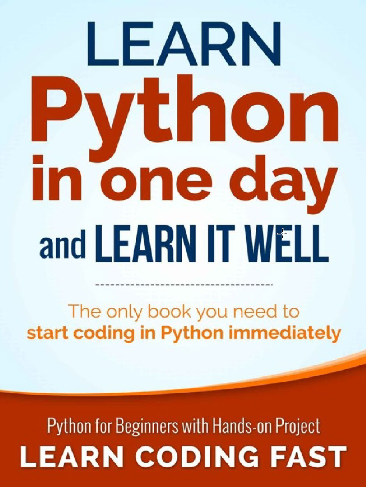

- [Python Notes](./pdf/PythonNOtes.pdf)

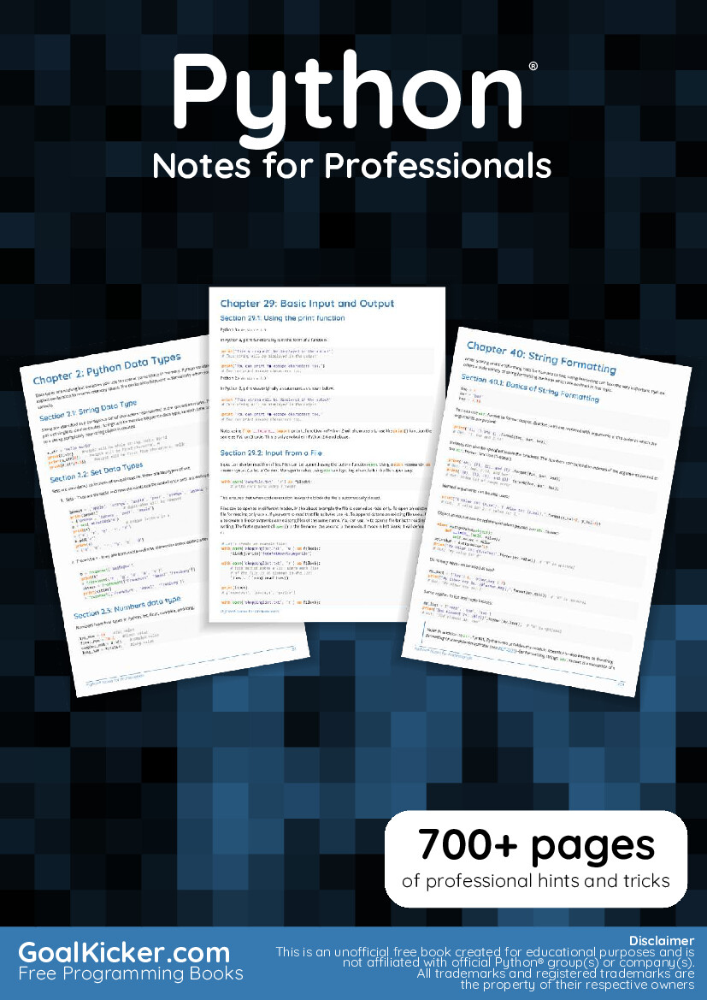

## A1Python-RegEx-Cheatsheet

 
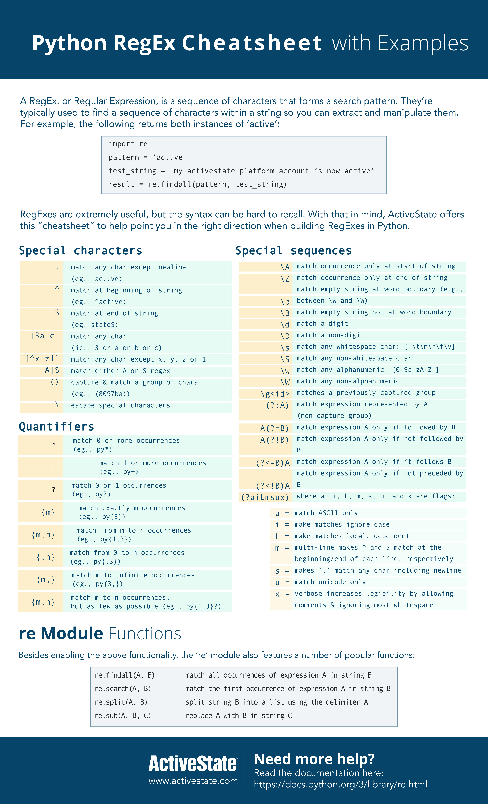

 
## A3VIM

 
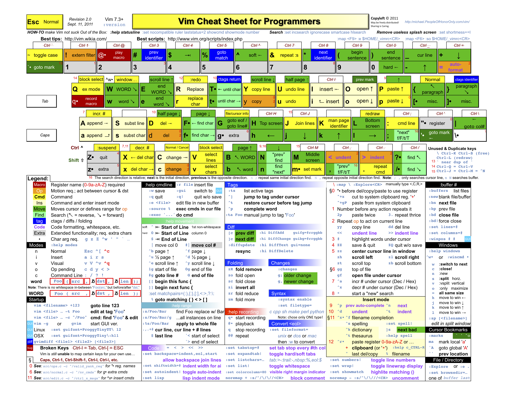

 
## ABegginers-Python-Cheat-Sheet

 
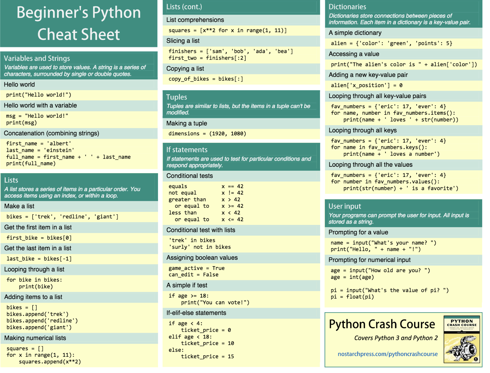

 

 
## D0MarkDown-0

 
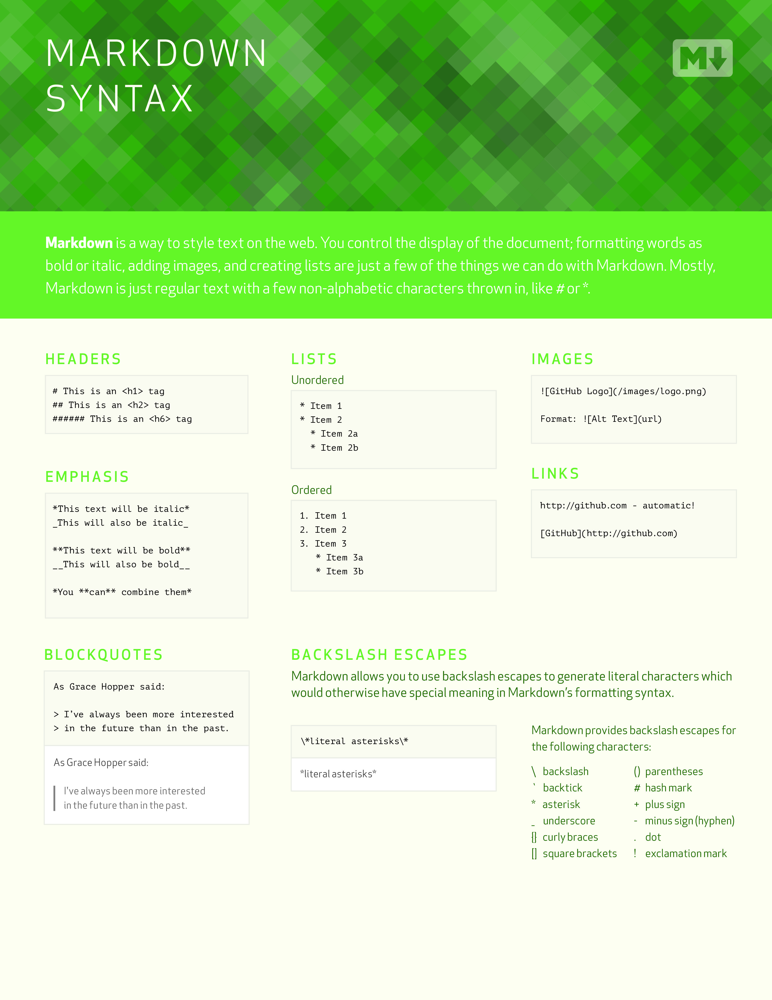

 

 
## DMarkDown-1

 
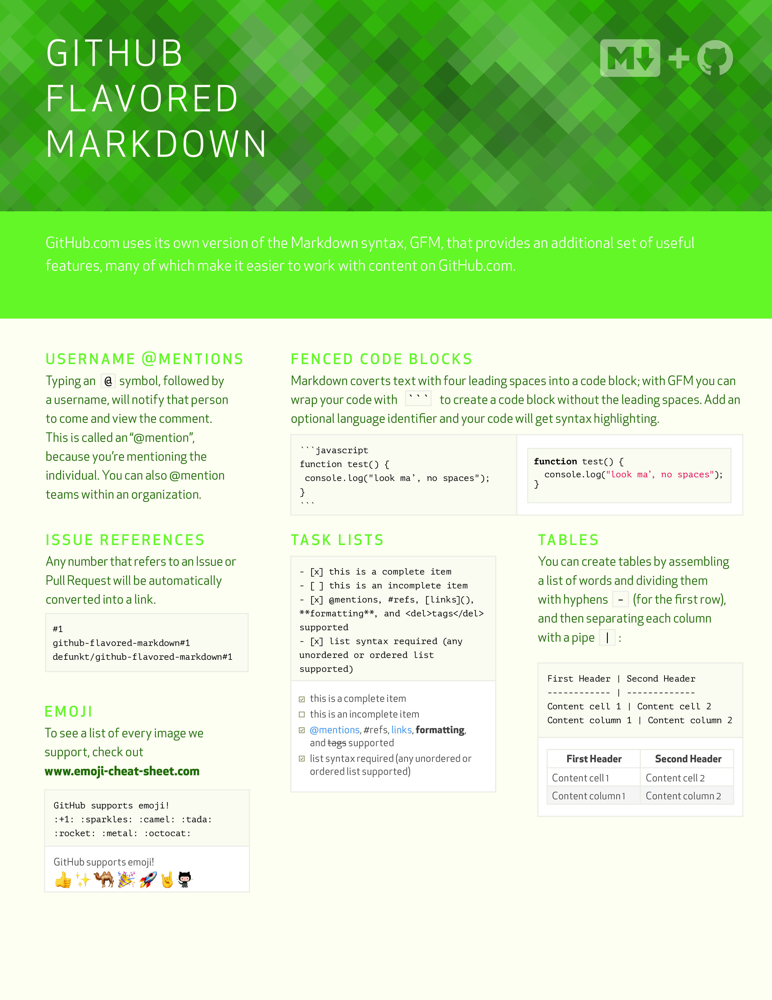

 
## Intermediate-Python-Cheat-Sheet-1

 
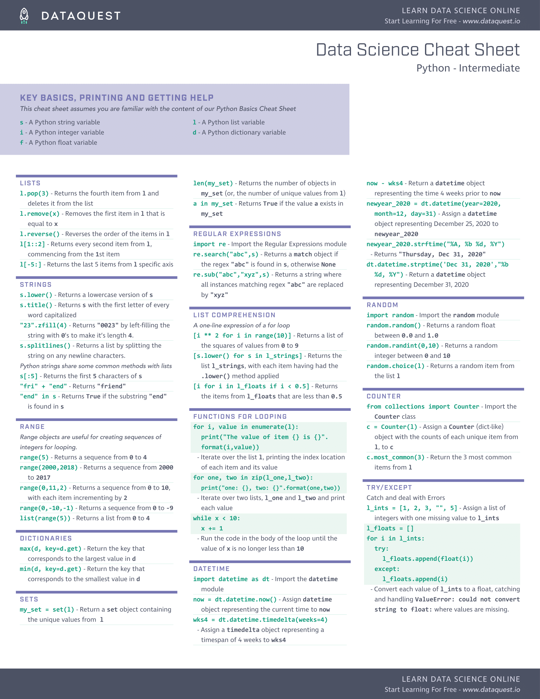

 
## P-Basics

 
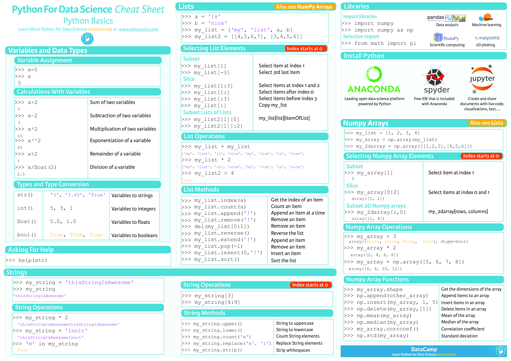

 
## PSCheetSheet

 
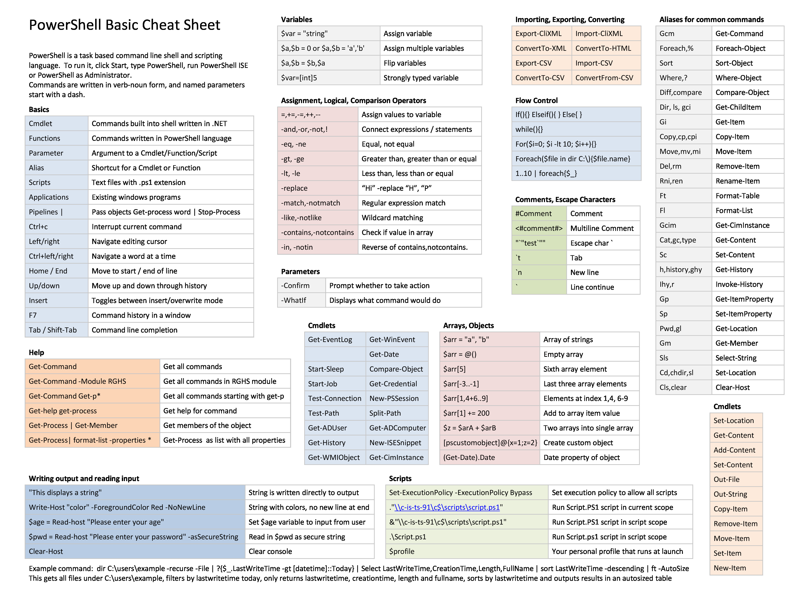

 
