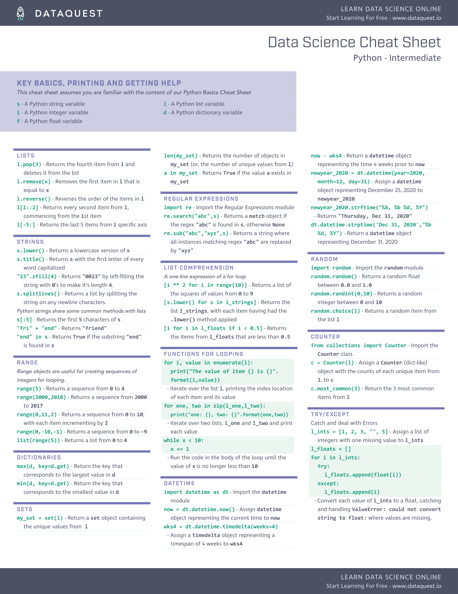
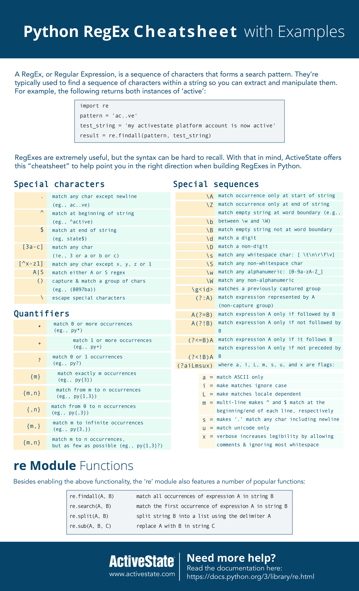

# CheetSheet Collection

## Todo

- [ ] Dualingo
- [ ] Do Touch Typing
- [ ] English Lesson 7 Max notes
- [ ] Watch this [NeetCode Python for Cdoing Interview](./res/videos/NeetCode-PythonForInterview[0K_eZGS5NsU].mp4)
- [ ] Type questions
- [ ] Type notes
- [ ] Redo what he does on video without looking
- [ ] LeetCode

## Top cheat sheets

## ABegginers-Python-Cheat-Sheet.png

 

 
## Intermediate-Python-Cheat-Sheet-1.png

 

 
    
## PSCheetSheet.jpg

 

 
## A1Python-RegEx-Cheatsheet.jpg

 

 
## A3VIM.png

 

